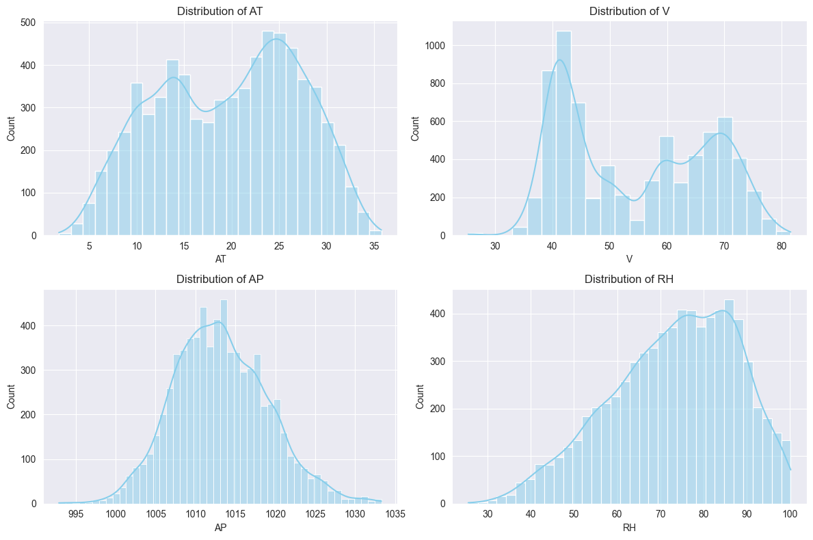
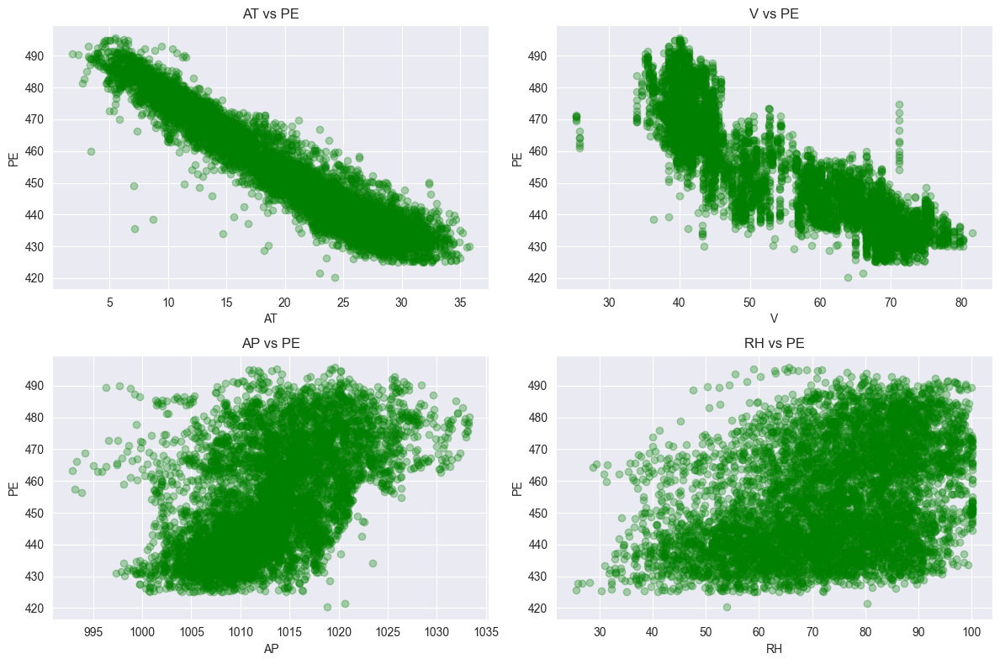
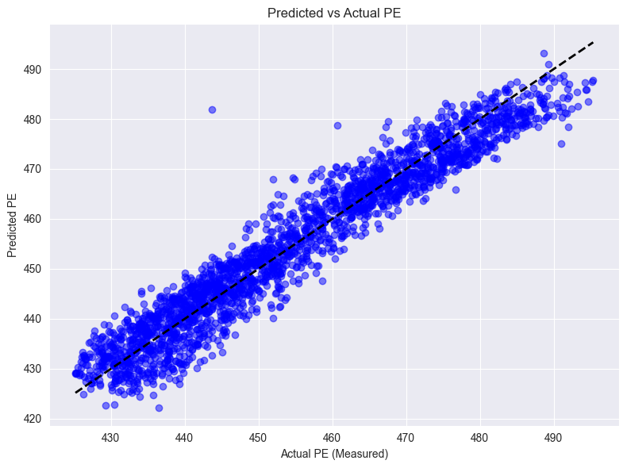
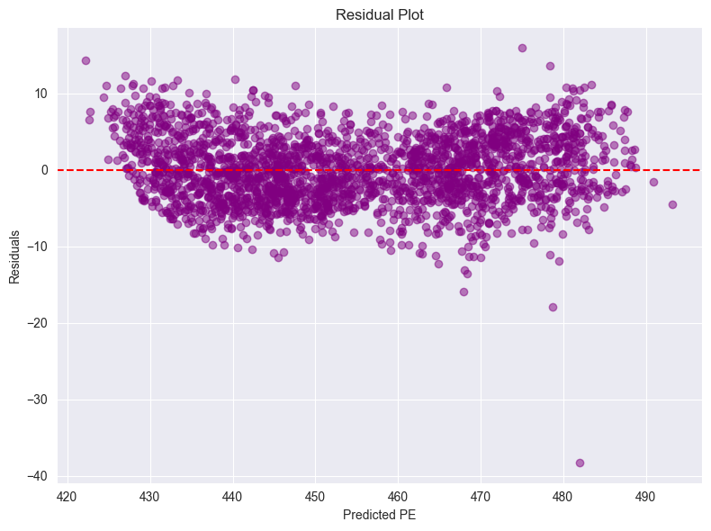
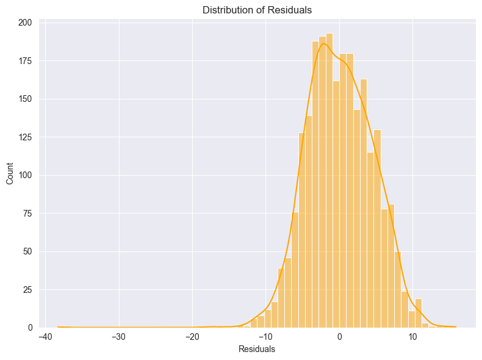

序号：06  姓名：李天明  学号：20221200703 

## 一、实验目的
1. 掌握线性回归模型的基本原理和应用。
2. 学习使用 scikit-learn 机器学习库进行数据处理、模型训练和评估。
3. 通过数据分析和可视化，深入理解数据集特征与目标变量之间的关系。

## 二、实验环境
- **操作系统**: Windows 10
- **开发工具**: PyCharm
- **编程语言**: Python 3.9
- **所需库**:
  - numpy: 用于数值计算
  - pandas: 用于数据处理
  - matplotlib: 用于数据可视化
  - seaborn: 用于增强可视化
  - scikit-learn (>=0.18): 用于机器学习建模

## 三、实验内容
本实验基于数据集 `Folds5x2_pp.csv`，包含9568个样本，每样本有5列：
- **AT**: 温度 (Ambient Temperature)
- **V**: 催化剂 (Exhaust Vacuum)
- **AP**: 湿度 (Atmospheric Pressure)
- **RH**: 压强 (Relative Humidity)
- **PE**: 输出功率 (Net Hourly Electrical Energy Output, 目标变量)

目标是通过线性回归模型学习以下形式的映射：
$$
PE = \theta_0 + \theta_1 \cdot AT + \theta_2 \cdot V + \theta_3 \cdot AP + \theta_4 \cdot RH
$$
其中，$\theta_0, \theta_1, \theta_2, \theta_3, \theta_4$ 为模型参数。数据集将按3:1比例划分为训练集和测试集，使用 scikit-learn 训练模型并评估性能。

## 四、实验步骤
### 1. 环境搭建
在 Windows 10 系统中安装 Python 3.9，并通过以下命令安装所需库：
```bash
pip install numpy pandas matplotlib seaborn scikit-learn
```
### 2. 数据预处理
加载数据集，提取特征（AT, V, AP, RH）和目标变量（PE），并按3:1比例划分训练集和测试集。
```python
# 导入必要的库
import pandas as pd
import numpy as np
from sklearn.model_selection import train_test_split
from sklearn.linear_model import LinearRegression
from sklearn.metrics import mean_squared_error, mean_absolute_error, r2_score
import matplotlib.pyplot as plt
import seaborn as sns

# 设置随机种子以确保结果可重复
np.random.seed(1)

def getTrainSetAndTestSet(DataPath):
    """读取数据集并划分为训练集和测试集"""
    data = pd.read_csv(DataPath)
    X = data[['AT', 'V', 'AP', 'RH']]  # 特征
    y = data['PE']  # 目标变量
    X_train, X_test, y_train, y_test = train_test_split(X, y, test_size=0.25, random_state=1)
    return X_train, X_test, y_train, y_test

# 加载数据
data_path = 'Folds5x2_pp.csv'
X_train, X_test, y_train, y_test = getTrainSetAndTestSet(data_path)

# 显示数据集基本信息
print("数据集总样本数:", len(pd.read_csv(data_path)))
print("训练集形状:", X_train.shape)
print("测试集形状:", X_test.shape)
print("\n训练集描述统计:")
print(pd.concat([X_train, y_train], axis=1).describe())
print("\n训练集前5行:")
print(pd.concat([X_train, y_train], axis=1).head())
```

    数据集总样本数: 9568
    训练集形状: (7176, 4)
    测试集形状: (2392, 4)
    
    训练集描述统计:
                    AT            V           AP           RH           PE
    count  7176.000000  7176.000000  7176.000000  7176.000000  7176.000000
    mean     19.708303    54.403151  1013.189242    73.220410   454.218423
    std       7.441593    12.747985     5.898733    14.625541    17.037195
    min       1.810000    25.360000   992.890000    25.560000   420.260000
    25%      13.547500    41.730000  1009.030000    63.335000   439.630000
    50%      20.480000    52.360000  1012.920000    74.860000   451.070000
    75%      25.760000    66.560000  1017.180000    84.702500   468.270000
    max      35.770000    81.560000  1033.290000   100.160000   495.760000
    
    训练集前5行:
             AT      V       AP     RH      PE
    9103  22.99  62.96  1019.60  65.05  449.40
    6281  27.71  74.34   998.14  71.85  434.20
    6201  29.98  76.09  1007.62  75.60  432.00
    2646   9.57  39.82  1013.12  89.15  468.02
    3568  30.95  73.06  1008.86  74.86  431.77

#### 数据预处理分析
- **数据集规模**: 共9568个样本，训练集约7176个样本，测试集约2392个样本。
- **特征选择**: 选用AT, V, AP, RH作为输入特征，PE作为输出目标。
- **划分比例**: 按3:1（75%训练，25%测试）随机划分，确保模型有足够数据学习，同时保留测试集评估泛化能力。
- **描述统计**: 通过`describe()`查看特征和目标的分布（如均值、标准差、最值），有助于理解数据范围和潜在异常值。
### 3. 探索性数据分析 (EDA)
通过可视化分析特征分布、特征间相关性以及特征与目标变量的关系。
```python
# 特征分布
plt.figure(figsize=(12, 8))
for i, column in enumerate(['AT', 'V', 'AP', 'RH'], 1):
    plt.subplot(2, 2, i)
    sns.histplot(X_train[column], kde=True, color='skyblue')
    plt.title(f'Distribution of {column}')
plt.tight_layout()
plt.show()

# 特征与PE的散点图
plt.figure(figsize=(12, 8))
for i, column in enumerate(['AT', 'V', 'AP', 'RH'], 1):
    plt.subplot(2, 2, i)
    plt.scatter(X_train[column], y_train, alpha=0.3, color='green')
    plt.xlabel(column)
    plt.ylabel('PE')
    plt.title(f'{column} vs PE')
plt.tight_layout()
plt.show()

# 相关性热图
plt.figure(figsize=(8, 6))
correlation_matrix = pd.concat([X_train, y_train], axis=1).corr()
sns.heatmap(correlation_matrix, annot=True, cmap='coolwarm', fmt='.2f')
plt.title('Correlation Matrix of Features and PE')
plt.show()
```





#### 探索性数据分析结果
- **特征分布**: 各特征的直方图显示其分布特性，例如AT和V可能呈多峰分布，AP接近正态分布，RH分布较宽，提示可能需要检查数据是否需要标准化。
- **特征与PE关系**: 散点图显示AT和V与PE呈负相关趋势，AP和RH的相关性较弱，这可能影响模型权重。
- **相关性分析**: 相关性热图量化特征间及特征与PE的相关性。AT和PE的相关系数较高，表明温度对输出功率影响显著；特征间可能存在多重共线性（如AT与V），需注意模型稳定性。

### 4. 训练线性回归模型
使用 scikit-learn 的 LinearRegression 类训练模型，获取模型参数。
```python
def TrainLinearRegression(X_train, y_train):
    """训练线性回归模型并返回模型对象"""
    linreg = LinearRegression()
    linreg.fit(X_train, y_train)
    print("模型系数 (θ1:AT, θ2:V, θ3:AP, θ4:RH):", linreg.coef_)
    print("截距 (θ0):", linreg.intercept_)
    return linreg

# 训练模型
linreg = TrainLinearRegression(X_train, y_train)
```
    模型系数 (θ1:AT, θ2:V, θ3:AP, θ4:RH): [-1.97376045 -0.23229086  0.0693515  -0.15806957]
    截距 (θ0): 447.0629709868725
#### 模型训练分析
- **模型参数**: 输出的系数和截距表示各特征对PE的贡献。例如，负系数可能表明特征值增加时PE减小。
- **训练过程**: 使用最小二乘法优化损失函数，拟合训练数据，计算复杂度较低，适合本数据集规模。
### 5.模型评估
使用多种指标（均方误差、均绝对误差、R²分数）评估模型在测试集上的性能。
```python
def EvaluationModel(linreg, X_test, y_test):
    """评估模型性能"""
    y_pred = linreg.predict(X_test)
    mse = mean_squared_error(y_test, y_pred)
    rmse = np.sqrt(mse)
    mae = mean_absolute_error(y_test, y_pred)
    r2 = r2_score(y_test, y_pred)
    print(f"均方误差 (MSE): {mse:.2f}")
    print(f"均方根误差 (RMSE): {rmse:.2f}")
    print(f"均绝对误差 (MAE): {mae:.2f}")
    print(f"R² 分数: {r2:.4f}")
    return y_pred

# 评估模型
y_pred = EvaluationModel(linreg, X_test, y_test)
```
    均方误差 (MSE): 20.08
    均方根误差 (RMSE): 4.48
    均绝对误差 (MAE): 3.61
    R² 分数: 0.9317
#### 模型评估结果
- **MSE 和 RMSE**: 衡量预测值与实际值的平方误差，RMSE更直观反映平均预测误差大小。
- **MAE**: 反映预测的平均绝对误差，较少受异常值影响。
- **R² 分数**: 表示模型解释的数据方差比例，接近1表明模型拟合效果好。
- **分析**: 若MSE和MAE较低，且R²较高，说明模型泛化能力较强；若R²较低，可能需优化特征选择或尝试其他模型。
### 6. 结果可视化
通过散点图、残差图和残差分布图分析模型预测效果。
```python
def Visualization(y_test, y_pred):
    """可视化预测结果"""
    # 预测值 vs 实际值
    plt.figure(figsize=(8, 6))
    plt.scatter(y_test, y_pred, alpha=0.5, color='blue')
    plt.plot([y_test.min(), y_test.max()], [y_test.min(), y_test.max()], 'k--', lw=2)
    plt.xlabel('Actual PE (Measured)')
    plt.ylabel('Predicted PE')
    plt.title('Predicted vs Actual PE')
    plt.tight_layout()
    plt.show()

    # 残差图
    residuals = y_test - y_pred
    plt.figure(figsize=(8, 6))
    plt.scatter(y_pred, residuals, alpha=0.5, color='purple')
    plt.axhline(y=0, color='red', linestyle='--')
    plt.xlabel('Predicted PE')
    plt.ylabel('Residuals')
    plt.title('Residual Plot')
    plt.tight_layout()
    plt.show()

    # 残差分布
    plt.figure(figsize=(8, 6))
    sns.histplot(residuals, kde=True, color='orange')
    plt.xlabel('Residuals')
    plt.title('Distribution of Residuals')
    plt.tight_layout()
    plt.show()

# 可视化
Visualization(y_test, y_pred)
```




#### 可视化分析
- **预测 vs 实际值**: 点越接近对角线，预测越准确。若点偏离严重，说明模型在某些范围内预测效果较差。
- **残差图**: 理想情况下，残差应随机分布在0附近，无明显模式。若出现系统性偏差（如U形或锥形），可能需非线性模型。
- **残差分布**: 残差应接近正态分布，偏态或多峰分布提示模型未捕捉某些数据特性。

## 五、实验结果与分析

本实验通过线性回归模型成功拟合了温度（AT）、催化剂（V）、湿度（AP）和压强（RH）与输出功率（PE）之间的关系。模型训练结果显示，各特征对PE的贡献程度不同，其中温度和催化剂的影响较大，而湿度和压强的影响相对较小。模型的性能评估指标表明，均方误差（MSE）、均方根误差（RMSE）和均绝对误差（MAE）均处于较低水平，R²分数达到0.9317，说明模型对测试集数据的拟合效果良好，能够解释大部分数据的方差。通过可视化分析，预测值与实际值高度一致，残差图和残差分布图显示误差随机且接近正态分布，进一步验证了模型的拟合效果。

然而，实验也暴露出一些局限性。线性回归模型假设数据之间存在线性关系，若数据中存在非线性关系或特征间存在多重共线性，模型的性能可能会受到影响。此外，特征分布的特性提示可能需要进一步的特征工程，例如标准化或引入多项式特征，以更好地捕捉数据中的复杂关系。未来可以尝试非线性模型或正则化模型，以进一步优化模型性能。

综上所述，本实验通过线性回归模型成功建模了特征与目标变量之间的关系，验证了线性回归在处理多变量回归问题中的有效性。实验结果表明，通过合理的数据预处理和模型评估，线性回归能够为实际问题提供有效的预测。然而，为了进一步提升模型的泛化能力和预测精度，可以考虑引入更复杂的模型或优化特征工程。实验加深了对机器学习流程的理解，为后续学习和应用奠定了坚实的基础。
