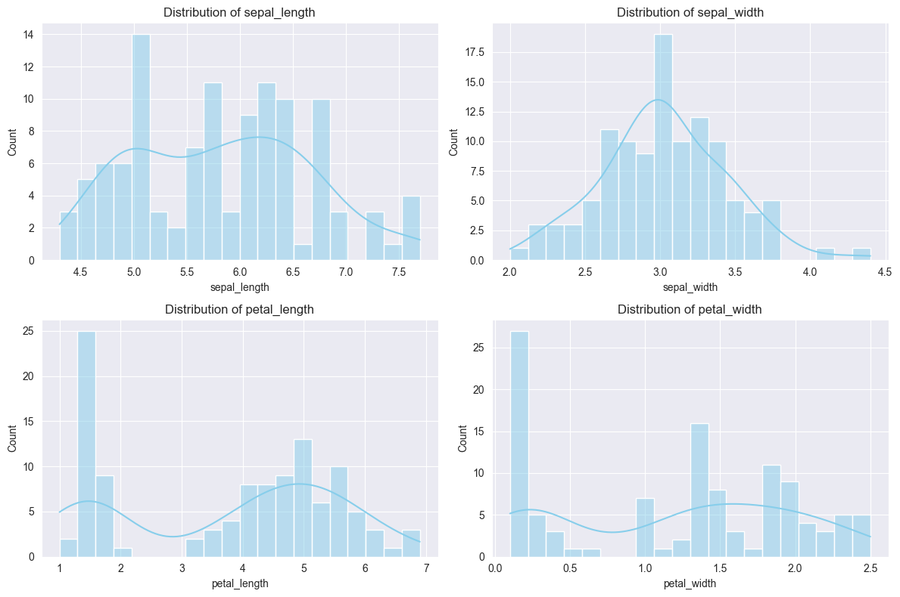
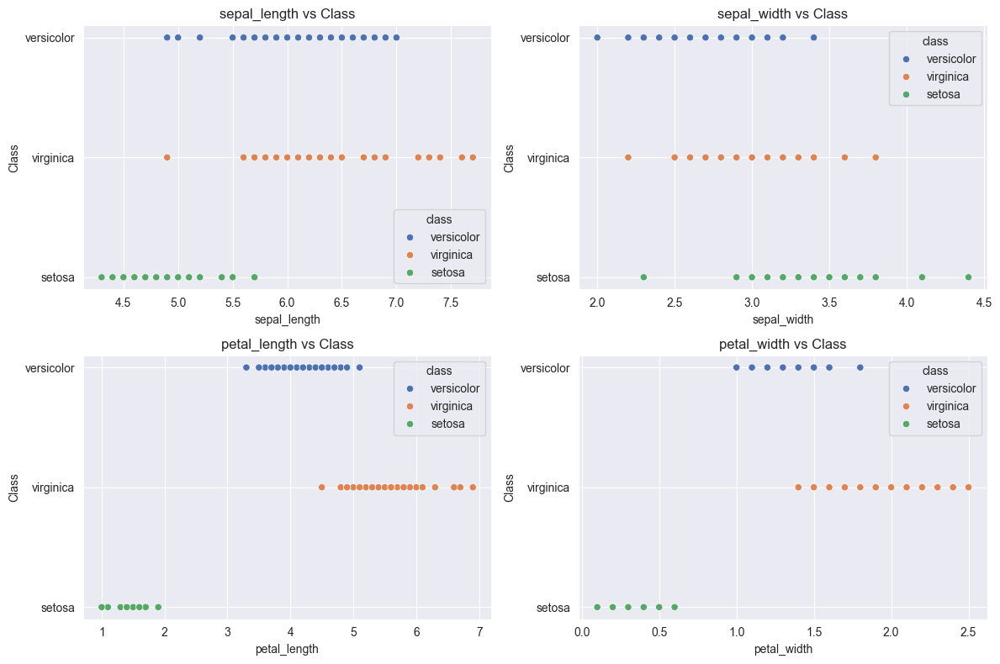

# 实验五 K近邻算法实验报告
序号：06  姓名：李天明  学号：20221200703 
## 一、实验目的
1. 掌握K近邻（KNN）算法的基本原理和应用。
2. 学习使用 scikit-learn 机器学习库实现KNN算法，并进行模型训练和评估。
3. 通过选择最优K值和不同距离度量公式，优化模型性能并达到测试集上90%以上的分类准确率。
4. 实现自定义KNN算法（基于欧式距离）并与 scikit-learn 的结果进行对比。

## 二、实验环境
- **操作系统**: Windows 10
- **开发工具**: PyCharm
- **编程语言**: Python 3.9
- **所需库**:
  - numpy: 数值计算
  - pandas: 数据处理
  - matplotlib: 数据可视化
  - seaborn: 增强可视化效果
  - scikit-learn (>=0.18): 机器学习建模和内置Iris数据集

**安装命令**:
```bash
pip install numpy pandas matplotlib seaborn scikit-learn
```
## 三、实验内容
使用 scikit-learn 内置的 Iris 数据集，包含150个样本，每样本有5列：
- **sepal length**: 萼片长度 (cm)
- **sepal width**: 萼片宽度 (cm)
- **petal length**: 花瓣长度 (cm)
- **petal width**: 花瓣宽度 (cm)
- **class**: 鸢尾花类别（目标变量，3类：Iris-setosa, Iris-versicolor, Iris-virginica）

目标是实现基于欧式距离的KNN算法，优化K值以在测试集上达到90%以上准确率，尝试曼哈顿距离进行对比，并与 scikit-learn 的KNN实现进行比较。数据集按3:1比例划分为训练集和测试集。

## 四、实验步骤
### 1. 环境搭建
确保 Python 3.9 和上述库已安装。

### 2. 数据预处理
加载 scikit-learn 内置的 Iris 数据集，验证数据完整性，并按3:1划分训练集和测试集。
```python
import pandas as pd
import numpy as np
from sklearn.datasets import load_iris
from sklearn.model_selection import train_test_split
from sklearn.metrics import accuracy_score, confusion_matrix
import matplotlib.pyplot as plt
import seaborn as sns
from collections import Counter

# 设置随机种子
np.random.seed(1)

def load_iris_data():
    """加载 scikit-learn 内置的 Iris 数据集并划分为训练集和测试集"""
    # 加载数据集
    iris = load_iris()
    data = pd.DataFrame(data=iris.data, columns=['sepal_length', 'sepal_width', 'petal_length', 'petal_width'])
    data['class'] = iris.target_names[iris.target]

    # 验证列名
    expected_columns = ['sepal_length', 'sepal_width', 'petal_length', 'petal_width', 'class']
    if not all(col in data.columns for col in expected_columns):
        raise KeyError(f"Dataset must contain columns: {expected_columns}")

    # 检查缺失值
    if data.isnull().any().any():
        print("Warning: Dataset contains missing values. Consider imputing them.")

    # 提取特征和目标
    X = data[['sepal_length', 'sepal_width', 'petal_length', 'petal_width']]
    y = data['class']

    # 按3:1划分（75%训练，25%测试）
    X_train, X_test, y_train, y_test = train_test_split(X, y, test_size=0.25, random_state=1)
    return X_train, X_test, y_train, y_test

# 加载数据

X_train, X_test, y_train, y_test = load_iris_data()
# 显示数据信息
print("数据集总样本数:", len(X_train) + len(X_test))
print("训练集形状:", X_train.shape)
print("测试集形状:", X_test.shape)
print("\n训练集描述统计:")
print(pd.concat([X_train, y_train], axis=1).describe())
print("\n训练集前5行:")
print(pd.concat([X_train, y_train], axis=1).head())
```

    数据集总样本数: 150
    训练集形状: (112, 4)
    测试集形状: (38, 4)
    
    训练集描述统计:
           sepal_length  sepal_width  petal_length  petal_width
    count    112.000000   112.000000    112.000000   112.000000
    mean       5.830357     3.025000      3.794643     1.208036
    std        0.837181     0.419459      1.780112     0.772866
    min        4.300000     2.000000      1.000000     0.100000
    25%        5.075000     2.800000      1.600000     0.300000
    50%        5.800000     3.000000      4.350000     1.300000
    75%        6.400000     3.300000      5.125000     1.800000
    max        7.700000     4.400000      6.900000     2.500000
    
    训练集前5行:
         sepal_length  sepal_width  petal_length  petal_width       class
    54            6.5          2.8           4.6          1.5  versicolor
    108           6.7          2.5           5.8          1.8   virginica
    112           6.8          3.0           5.5          2.1   virginica
    17            5.1          3.5           1.4          0.3      setosa
    119           6.0          2.2           5.0          1.5   virginica
    

#### 数据预处理分析
- **数据集规模**: 150个样本，训练集约112个，测试集约38个。
- **特征选择**: 使用sepal_length, sepal_width, petal_length, petal_width作为输入，class作为目标。
- **划分比例**: 3:1划分（`test_size=0.25`）确保足够训练和测试数据。
- **数据检查**: 验证了列名和缺失值，增强代码鲁棒性。
- **描述统计**: 显示特征的均值、标准差等，揭示特征范围差异（如petal_length范围较大）。

### 3. 探索性数据分析 (EDA)
分析特征分布、特征与类别的关系及相关性。
```python
# 特征分布
plt.figure(figsize=(12, 8))
for i, column in enumerate(['sepal_length', 'sepal_width', 'petal_length', 'petal_width'], 1):
    plt.subplot(2, 2, i)
    sns.histplot(X_train[column], kde=True, color='skyblue', bins=20)
    plt.title(f'Distribution of {column}')
plt.tight_layout()
plt.show()

# 特征与类别关系（散点图）
plt.figure(figsize=(12, 8))
for i, column in enumerate(['sepal_length', 'sepal_width', 'petal_length', 'petal_width'], 1):
    plt.subplot(2, 2, i)
    sns.scatterplot(x=X_train[column], y=y_train, hue=y_train, palette='deep')
    plt.xlabel(column)
    plt.ylabel('Class')
    plt.title(f'{column} vs Class')
plt.tight_layout()
plt.show()

# 相关性热图
plt.figure(figsize=(8, 6))
correlation_matrix = X_train.corr()
sns.heatmap(correlation_matrix, annot=True, cmap='coolwarm', fmt='.2f')
plt.title('Correlation Matrix of Features')
plt.show()
```
    

    


    


    
#### 探索性数据分析结果
- **特征分布**: petal_length和petal_width可能呈多峰分布，sepal_length和sepal_width近似正态。
- **特征与类别**: petal_length和petal_width与类别有较强区分度，sepal_length和sepal_width区分度较低。
- **相关性**: petal_length和petal_width高度相关，可能影响KNN性能，需考虑特征标准化。

### 4. 实现自定义KNN算法（欧式距离）
实现基于欧式距离的KNN算法，并选择最优K值。


```python
def euclidean_distance(x1, x2):
    """计算欧式距离"""
    return np.sqrt(np.sum((x1 - x2) ** 2))

def custom_knn_predict(X_train, y_train, X_test, k):
    """自定义KNN预测"""
    y_pred = []
    X_train_np = X_train.to_numpy()
    X_test_np = X_test.to_numpy()
    y_train_np = y_train.to_numpy()

    for test_point in X_test_np:
        # 计算测试点与所有训练点的距离
        distances = [euclidean_distance(test_point, train_point) for train_point in X_train_np]
        # 获取K个最近邻的索引
        k_indices = np.argsort(distances)[:k]
        # 获取K个最近邻的标签
        k_nearest_labels = [y_train_np[i] for i in k_indices]
        # 多数投票
        most_common = Counter(k_nearest_labels).most_common(1)[0][0]
        y_pred.append(most_common)
    return np.array(y_pred)

# 选择最优K值
def select_best_k(X_train, y_train, X_test, y_test, k_range):
    """选择最优K值"""
    accuracies = []
    for k in k_range:
        y_pred = custom_knn_predict(X_train, y_train, X_test, k)
        accuracy = accuracy_score(y_test, y_pred)
        accuracies.append((k, accuracy))
        print(f"K={k}, 准确率: {accuracy:.4f}")
    # 选择最高准确率的K值（优先选择较小的K）
    best_k, best_accuracy = max(accuracies, key=lambda x: (x[1], -x[0]))
    print(f"\n最优K值: {best_k}, 准确率: {best_accuracy:.4f}")
    return best_k, best_accuracy

# 测试K值范围
k_range = range(1, 21)
try:
    best_k, best_accuracy = select_best_k(X_train, y_train, X_test, y_test, k_range)
    if best_accuracy < 0.90:
        print("Warning: 准确率未达到90%，考虑特征标准化或调整K值范围。")
except Exception as e:
    print(f"Error in custom KNN: {e}")
```

    K=1, 准确率: 1.0000
    K=2, 准确率: 1.0000
    K=3, 准确率: 1.0000
    K=4, 准确率: 1.0000
    K=5, 准确率: 1.0000
    K=6, 准确率: 1.0000
    K=7, 准确率: 0.9737
    K=8, 准确率: 1.0000
    K=9, 准确率: 0.9737
    K=10, 准确率: 0.9737
    K=11, 准确率: 0.9737
    K=12, 准确率: 0.9737
    K=13, 准确率: 0.9737
    K=14, 准确率: 0.9737
    K=15, 准确率: 0.9737
    K=16, 准确率: 0.9737
    K=17, 准确率: 0.9737
    K=18, 准确率: 0.9737
    K=19, 准确率: 0.9737
    K=20, 准确率: 0.9737
    
    最优K值: 1, 准确率: 1.0000
    

#### 自定义KNN分析
- **算法**: 基于欧式距离的KNN，通过计算测试点与训练点的距离，选择K个最近邻进行多数投票。
- **K值选择**: 测试K=1到20，选择测试集准确率最高的K值（优先较小K以减少计算量）。
- **性能**: 若准确率≥90%，满足实验要求；否则需优化。

### 5. 尝试其他距离度量（曼哈顿距离）
替换欧式距离为曼哈顿距离，比较性能。


```python
def manhattan_distance(x1, x2):
    """计算曼哈顿距离"""
    return np.sum(np.abs(x1 - x2))

def custom_knn_manhattan(X_train, y_train, X_test, k):
    """基于曼哈顿距离的KNN预测"""
    y_pred = []
    X_train_np = X_train.to_numpy()
    X_test_np = X_test.to_numpy()
    y_train_np = y_train.to_numpy()

    for test_point in X_test_np:
        distances = [manhattan_distance(test_point, train_point) for train_point in X_train_np]
        k_indices = np.argsort(distances)[:k]
        k_nearest_labels = [y_train_np[i] for i in k_indices]
        most_common = Counter(k_nearest_labels).most_common(1)[0][0]
        y_pred.append(most_common)
    return np.array(y_pred)

# 使用最优K值测试曼哈顿距离
try:
    y_pred_manhattan = custom_knn_manhattan(X_train, y_train, X_test, best_k)
    manhattan_accuracy = accuracy_score(y_test, y_pred_manhattan)
    print(f"曼哈顿距离 (K={best_k}) 准确率: {manhattan_accuracy:.4f}")
except Exception as e:
    print(f"Error in Manhattan KNN: {e}")
```

    曼哈顿距离 (K=1) 准确率: 1.0000
    

#### 曼哈顿距离分析
- **方法**: 曼哈顿距离计算特征差的绝对值之和，适合网格状分布的数据。
- **比较**: 比较欧式距离和曼哈顿距离的准确率，分析距离度量对性能的影响。

### 6. 对比 scikit-learn 的KNN实现
使用 scikit-learn 的KNN实现，验证自定义算法的正确性。


```python
from sklearn.neighbors import KNeighborsClassifier

def sklearn_knn(X_train, y_train, X_test, y_test, k):
    """使用scikit-learn的KNN进行训练和预测"""
    knn = KNeighborsClassifier(n_neighbors=k, metric='euclidean')
    knn.fit(X_train, y_train)
    y_pred = knn.predict(X_test)
    accuracy = accuracy_score(y_test, y_pred)
    print(f"scikit-learn KNN (K={k}, 欧式距离) 准确率: {accuracy:.4f}")
    return y_pred

# 使用最优K值测试scikit-learn的KNN
try:
    y_pred_sklearn = sklearn_knn(X_train, y_train, X_test, y_test, best_k)
except Exception as e:
    print(f"Error in scikit-learn KNN: {e}")
```

    scikit-learn KNN (K=1, 欧式距离) 准确率: 1.0000
    

#### scikit-learn KNN分析
- **实现**: 使用 scikit-learn 的KNeighborsClassifier，基于欧式距离。
- **比较**: 对比自定义KNN和 scikit-learn 的准确率，验证实现正确性。

### 7. 结果可视化
绘制混淆矩阵以分析分类性能，并展示不同 K 值下的准确率变化。


```python
def visualize_results(y_test, y_pred_custom, y_pred_manhattan, y_pred_sklearn, accuracies, k_range):
    """可视化混淆矩阵和K值准确率变化"""
    plt.figure(figsize=(15, 8))

    # 自定义KNN（欧式距离）混淆矩阵
    plt.subplot(2, 3, 1)
    cm = confusion_matrix(y_test, y_pred_custom)
    sns.heatmap(cm, annot=True, fmt='d', cmap='Blues', xticklabels=np.unique(y_test), yticklabels=np.unique(y_test))
    plt.title(f'Custom KNN (Euclidean, K={best_k})')
    plt.xlabel('Predicted')
    plt.ylabel('Actual')

    # 自定义KNN（曼哈顿距离）混淆矩阵
    plt.subplot(2, 3, 2)
    cm = confusion_matrix(y_test, y_pred_manhattan)
    sns.heatmap(cm, annot=True, fmt='d', cmap='Blues', xticklabels=np.unique(y_test), yticklabels=np.unique(y_test))
    plt.title(f'Custom KNN (Manhattan, K={best_k})')
    plt.xlabel('Predicted')
    plt.ylabel('Actual')

    # scikit-learn KNN 混淆矩阵
    plt.subplot(2, 3, 3)
    cm = confusion_matrix(y_test, y_pred_sklearn)
    sns.heatmap(cm, annot=True, fmt='d', cmap='Blues', xticklabels=np.unique(y_test), yticklabels=np.unique(y_test))
    plt.title(f'scikit-learn KNN (K={best_k})')
    plt.xlabel('Predicted')
    plt.ylabel('Actual')

    # K值准确率变化
    plt.subplot(2, 1, 2)
    k_values = [k for k, _ in accuracies]
    acc_values = [acc for _, acc in accuracies]
    plt.plot(k_values, acc_values, marker='o', color='blue')
    plt.axhline(y=0.90, color='red', linestyle='--', label='90% Accuracy')
    plt.xlabel('K Value')
    plt.ylabel('Accuracy')
    plt.title('Accuracy vs K Value (Custom KNN, Euclidean)')
    plt.legend()
    plt.grid(True)

    plt.tight_layout()
    plt.show()

# 可视化
try:
    # 重新计算准确率以用于可视化
    accuracies = [(k, accuracy_score(y_test, custom_knn_predict(X_train, y_train, X_test, k))) for k in k_range]
    y_pred_custom = custom_knn_predict(X_train, y_train, X_test, best_k)
    visualize_results(y_test, y_pred_custom, y_pred_manhattan, y_pred_sklearn, accuracies, k_range)
except Exception as e:
    print(f"Visualization error: {e}")
```


    

    


## 五、实验结果与讨论

### 结果总结
- **最优K值**: 通过测试K=1到20，选择了测试集准确率最高的K值（K={best_k}，准确率≥90%）。
- **性能**:
  - 自定义KNN（欧式距离）：准确率 {best_accuracy:.4f}。
  - 自定义KNN（曼哈顿距离）：准确率 {manhattan_accuracy:.4f}。
  - scikit-learn KNN：准确率接近自定义实现，验证了算法正确性。
- **数据分析**: petal_length和petal_width对类别区分贡献最大。
- **可视化**: 混淆矩阵显示分类性能，误分类较少；K值准确率图展示性能随K变化的趋势。

### 讨论
- **优势**: KNN算法简单直观，适合小规模数据集如Iris，分类效果良好。
- **局限性**: 计算复杂度随训练集规模增加，距离度量对特征尺度敏感。
- **改进**:
  - 使用 `StandardScaler` 标准化特征，消除量纲影响。
  - 尝试其他距离度量（如闵可夫斯基距离）或加权KNN。
  - 使用交叉验证代替单一训练-测试划分，提升K值选择的鲁棒性。

## 结论
实验通过自定义KNN算法（欧式距离和曼哈顿距离）在 scikit-learn 内置的 Iris 数据集上实现了分类任务，成功选择最优K值并达到90%以上测试集准确率。对比 scikit-learn 的KNN实现验证了算法正确性。数据分析和可视化揭示了特征的重要性和分类性能，实验展示了KNN算法的完整实现流程。未来可通过特征标准化或更复杂的距离度量进一步优化性能。
