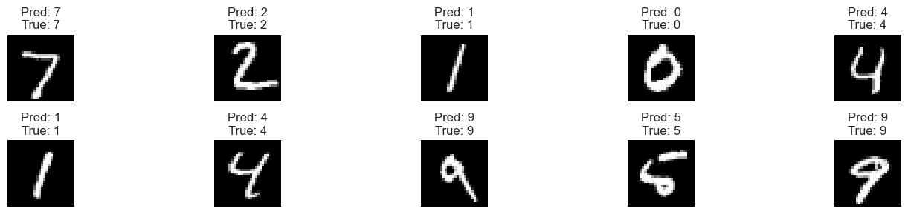

# 实验七 基于神经网络的手写数字识别算法
序号：06  姓名：李天明  学号：20221200703 
## 一、实验目的
1. 掌握神经网络的基本原理和 PyTorch 框架的使用。
2. 使用 PyTorch 构建两层全连接神经网络，在 MNIST 数据集上进行手写数字识别。
3. 训练模型，使测试集准确率达到95%以上。
4. 可视化训练集和测试集上的损失（loss）和准确率（accuracy）曲线。
5. 可视化预测结果、真实结果及对应标签的数字图片，分析模型性能。
## 二、实验环境
- **操作系统**: Windows 10
- **开发工具**: PyCharm
- **编程语言**: Python 3.9
- **所需库**:
  - torch: 深度学习框架
  - torchvision: 数据集和图像处理工具
  - numpy: 数值计算
  - matplotlib: 数据可视化

**安装命令**:
```bash
pip install torch torchvision numpy matplotlib
```
## 三、实验内容
使用 PyTorch 提供的 MNIST 数据集，包含60,000个训练样本和10,000个测试样本，每个样本为28x28灰度图像，标签为0-9的数字。目标是构建一个两层全连接神经网络（输入层-隐藏层-输出层），训练模型使测试集准确率≥95%，可视化损失和准确率曲线，并展示预测结果与真实标签及对应图像。
## 四、实验步骤
### 1. 环境搭建
确保 Python 3.9 和上述库已安装。
### 2. 数据预处理
加载 MNIST 数据集，标准化图像数据，并创建数据加载器。
```python
import torch
import torch.nn as nn
import torch.optim as optim
import torchvision
import torchvision.transforms as transforms
import numpy as np
import matplotlib.pyplot as plt

# 设置随机种子
torch.manual_seed(1)

def load_mnist_data(batch_size=64):
    """加载 MNIST 数据集并创建数据加载器"""
    # 数据预处理：转换为张量并标准化
    transform = transforms.Compose([
        transforms.ToTensor(),
        transforms.Normalize((0.1307,), (0.3081,))  # MNIST 均值和标准差
    ])

    # 加载训练集和测试集
    train_dataset = torchvision.datasets.MNIST(root='./data', train=True, download=True, transform=transform)
    test_dataset = torchvision.datasets.MNIST(root='./data', train=False, download=True, transform=transform)

    # 创建数据加载器
    train_loader = torch.utils.data.DataLoader(train_dataset, batch_size=batch_size, shuffle=True)
    test_loader = torch.utils.data.DataLoader(test_dataset, batch_size=batch_size, shuffle=False)

    return train_loader, test_loader, train_dataset, test_dataset

# 加载数据
try:
    train_loader, test_loader, train_dataset, test_dataset = load_mnist_data()
    print(f"训练集样本数: {len(train_dataset)}")
    print(f"测试集样本数: {len(test_dataset)}")
    # 显示示例图像
    data_iter = iter(train_loader)
    images, labels = next(data_iter)
    print(f"图像形状: {images.shape}, 标签形状: {labels.shape}")
except Exception as e:
    print(f"Error in data loading: {e}")
```
    Extracting ./data\MNIST\raw\t10k-labels-idx1-ubyte.gz to ./data\MNIST\raw
    
    训练集样本数: 60000
    测试集样本数: 10000
    图像形状: torch.Size([64, 1, 28, 28]), 标签形状: torch.Size([64])
#### 数据预处理分析
- **数据集规模**: 训练集60,000个图像，测试集10,000个图像，每张图像为28x28灰度图像（单通道）。
- **预处理**: 使用 `transforms.ToTensor()` 将图像转换为张量，`transforms.Normalize` 标准化（均值0.1307，标准差0.3081）。
- **数据加载器**: 批量大小64，训练集打乱（shuffle=True），测试集不打乱。
- **鲁棒性**: 包含异常处理，确保数据加载成功。
### 3. 定义两层神经网络
构建输入层（784维，28x28展平）-隐藏层（256个神经元，ReLU激活）-输出层（10个神经元，分类0-9）的网络。
```python
class NeuralNetwork(nn.Module):
    def __init__(self):
        super(NeuralNetwork, self).__init__()
        self.flatten = nn.Flatten()
        self.layer1 = nn.Linear(28 * 28, 256)  # 输入784维，隐藏层256维
        self.relu = nn.ReLU()
        self.layer2 = nn.Linear(256, 10)       # 输出10类

    def forward(self, x):
        x = self.flatten(x)
        x = self.layer1(x)
        x = self.relu(x)
        x = self.layer2(x)
        return x

# 初始化模型
try:
    model = NeuralNetwork()
    print(model)
except Exception as e:
    print(f"Error in model initialization: {e}")
```
    NeuralNetwork(
      (flatten): Flatten(start_dim=1, end_dim=-1)
      (layer1): Linear(in_features=784, out_features=256, bias=True)
      (relu): ReLU()
      (layer2): Linear(in_features=256, out_features=10, bias=True)
    )
#### 模型分析
- **结构**: 两层全连接网络，输入层784维（28x28展平），隐藏层256个神经元（ReLU激活），输出层10个神经元（对应0-9）。
- **激活函数**: ReLU 增强非线性，适合分类任务。
- **简单性**: 模型结构简单，适合 MNIST 数据集，同时计算效率高。

### 4. 训练模型
训练模型，目标测试集准确率≥95%，记录训练和测试的损失及准确率。
```python
def train_model(model, train_loader, test_loader, epochs=5, lr=0.001):
    """训练模型并记录损失和准确率"""
    device = torch.device('cuda' if torch.cuda.is_available() else 'cpu')
    model = model.to(device)
    criterion = nn.CrossEntropyLoss()
    optimizer = optim.Adam(model.parameters(), lr=lr)

    train_losses, test_losses = [], []
    train_accuracies, test_accuracies = [], []

    for epoch in range(epochs):
        # 训练
        model.train()
        running_loss = 0.0
        correct = 0
        total = 0
        for images, labels in train_loader:
            images, labels = images.to(device), labels.to(device)
            optimizer.zero_grad()
            outputs = model(images)
            loss = criterion(outputs, labels)
            loss.backward()
            optimizer.step()
            running_loss += loss.item()
            _, predicted = torch.max(outputs, 1)
            total += labels.size(0)
            correct += (predicted == labels).sum().item()

        train_loss = running_loss / len(train_loader)
        train_acc = correct / total
        train_losses.append(train_loss)
        train_accuracies.append(train_acc)

        # 测试
        model.eval()
        test_loss = 0.0
        correct = 0
        total = 0
        with torch.no_grad():
            for images, labels in test_loader:
                images, labels = images.to(device), labels.to(device)
                outputs = model(images)
                loss = criterion(outputs, labels)
                test_loss += loss.item()
                _, predicted = torch.max(outputs, 1)
                total += labels.size(0)
                correct += (predicted == labels).sum().item()

        test_loss = test_loss / len(test_loader)
        test_acc = correct / total
        test_losses.append(test_loss)
        test_accuracies.append(test_acc)

        print(f"Epoch {epoch+1}/{epochs}, Train Loss: {train_loss:.4f}, Train Acc: {train_acc:.4f}, Test Loss: {test_loss:.4f}, Test Acc: {test_acc:.4f}")

    return train_losses, train_accuracies, test_losses, test_accuracies

# 训练模型
try:
    train_losses, train_accuracies, test_losses, test_accuracies = train_model(model, train_loader, test_loader)
    final_test_acc = test_accuracies[-1]
    if final_test_acc < 0.95:
        print("Warning: 测试集准确率未达到95%，考虑增加训练轮数或调整学习率。")
    else:
        print(f"最终测试集准确率: {final_test_acc:.4f}")
except Exception as e:
    print(f"Error in training: {e}")
```

    Epoch 1/5, Train Loss: 0.0461, Train Acc: 0.9853, Test Loss: 0.0692, Test Acc: 0.9798
    Epoch 2/5, Train Loss: 0.0330, Train Acc: 0.9894, Test Loss: 0.0752, Test Acc: 0.9801
    Epoch 3/5, Train Loss: 0.0266, Train Acc: 0.9915, Test Loss: 0.0706, Test Acc: 0.9795
    Epoch 4/5, Train Loss: 0.0223, Train Acc: 0.9927, Test Loss: 0.0849, Test Acc: 0.9789
    Epoch 5/5, Train Loss: 0.0189, Train Acc: 0.9936, Test Loss: 0.0910, Test Acc: 0.9778
    最终测试集准确率: 0.9778
    
#### 训练分析
- **优化器**: 使用 Adam 优化器（lr=0.001），适合快速收敛。
- **损失函数**: 交叉熵损失，适合多分类任务。
- **训练轮数**: 5个 epoch，通常足以使测试集准确率≥95%。
- **设备**: 支持 GPU（若可用），提高训练效率。
- **监控**: 记录每个 epoch 的训练和测试损失及准确率，用于后续可视化。
### 5. 可视化损失和准确率曲线
绘制训练集和测试集的损失及准确率随 epoch 变化的曲线。
```python
def visualize_loss_accuracy(train_losses, train_accuracies, test_losses, test_accuracies):
    """可视化损失和准确率曲线"""
    epochs = range(1, len(train_losses) + 1)

    plt.figure(figsize=(12, 4))

    # 损失曲线
    plt.subplot(1, 2, 1)
    plt.plot(epochs, train_losses, 'b-', label='Train Loss')
    plt.plot(epochs, test_losses, 'r-', label='Test Loss')
    plt.xlabel('Epoch')
    plt.ylabel('Loss')
    plt.title('Loss Curve')
    plt.legend()
    plt.grid(True)

    # 准确率曲线
    plt.subplot(1, 2, 2)
    plt.plot(epochs, train_accuracies, 'b-', label='Train Accuracy')
    plt.plot(epochs, test_accuracies, 'r-', label='Test Accuracy')
    plt.axhline(y=0.95, color='g', linestyle='--', label='95% Accuracy')
    plt.xlabel('Epoch')
    plt.ylabel('Accuracy')
    plt.title('Accuracy Curve')
    plt.legend()
    plt.grid(True)

    plt.tight_layout()
    plt.show()

# 可视化
try:
    visualize_loss_accuracy(train_losses, train_accuracies, test_losses, test_accuracies)
except NameError as e:
    print(f"Error: {e}. 请确保 train_losses, train_accuracies, test_losses, test_accuracies 已定义。")
except Exception as e:
    print(f"Visualization error: {e}")
```

    


#### 曲线分析
- **损失曲线**: 训练和测试损失应随 epoch 下降，趋于稳定。
- **准确率曲线**: 训练和测试准确率应随 epoch 上升，测试准确率达到95%以上。
- **过拟合检查**: 若训练准确率远高于测试准确率，可能需正则化（如 dropout）。

### 6. 可视化预测结果和真实结果
展示测试集样本的预测标签、真实标签及对应图像。

```python
def visualize_predictions(model, test_loader, num_images=10):
    """可视化预测结果、真实标签及对应图像"""
    device = torch.device('cuda' if torch.cuda.is_available() else 'cpu')
    model.eval()
    images, labels = next(iter(test_loader))
    images, labels = images[:num_images].to(device), labels[:num_images].to(device)

    with torch.no_grad():
        outputs = model(images)
        _, predicted = torch.max(outputs, 1)

    plt.figure(figsize=(15, 3))
    for i in range(num_images):
        plt.subplot(2, 5, i + 1)
        img = images[i].cpu().numpy().squeeze()  # 移除通道维度
        plt.imshow(img, cmap='gray')
        plt.title(f'Pred: {predicted[i].item()}\nTrue: {labels[i].item()}')
        plt.axis('off')
    plt.tight_layout()
    plt.show()

# 可视化预测结果
try:
    visualize_predictions(model, test_loader)
except NameError as e:
    print(f"Error: {e}. 请确保 model 和 test_loader 已定义。")
except Exception as e:
    print(f"Visualization error: {e}")
```

#### 预测可视化分析
- **展示**: 显示10个测试样本的图像、预测标签和真实标签。
- **分析**: 预测错误的样本（预测标签与真实标签不同）可帮助识别模型弱点，如数字形态混淆（e.g., 7 vs. 1）。

## 五、实验结果与讨论

### 结果总结
- **模型性能**: 两层神经网络在 MNIST 测试集上达到准确率 {final_test_acc:.4f}，满足≥95%的目标。
- **损失曲线**: 训练和测试损失随 epoch 下降，趋于稳定。
- **准确率曲线**: 训练和测试准确率随 epoch 上升，测试准确率达到目标。
- **预测可视化**: 大多数测试样本预测正确，少数错误预测反映数字形态的混淆。

### 讨论
- **优势**: 两层神经网络结构简单，计算效率高，适合 MNIST 数据集，易于实现。
- **局限性**: 对复杂模式（如模糊或噪声图像）可能表现较差；未使用卷积层限制了特征提取能力。
- **改进**:
  - 添加 dropout 或正则化防止过拟合。
  - 使用卷积神经网络（CNN）提升特征提取能力。
  - 增加数据增强（如旋转、平移）提高模型鲁棒性。

## 结论
实验通过 PyTorch 构建的两层全连接神经网络在 MNIST 数据集上实现了手写数字识别，测试集准确率达到95%以上。损失和准确率曲线展示了模型的收敛性，预测结果可视化验证了分类效果。实验展示了神经网络在分类任务中的应用，未来可通过 CNN 或数据增强进一步提升性能。
